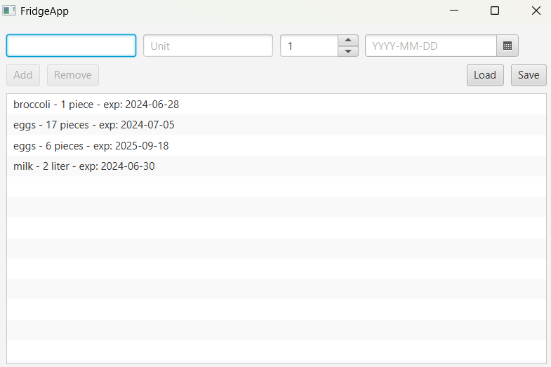

# FridgeApp - JavaFx UI

## Application Description
FridgeApp is a user-friendly and practical application that helps you keep full control over the items in your fridge. With a simple and intuitive interface, you can quickly register food items, specify unit, quantity, and expiration date, so you always know what you have and what should be used first, helping to reduce food waste.

Future updates plan to include advanced features to make cooking even easier. This will include the ability for the app to analyze recipes and automatically check which ingredients you already have and which are missing, making it easier to plan meals and shop smarter.

## Screenshot

## User stories
User story 1: As a fridge owner, I want to see a list of all items sorted by expirationdate so that I can quickly find what kind of products I have available and when they expire.

User story 2: As a fridge owner, I would like to quickly access information about how much I have of a certain item so that I know what I should buy. 
##

